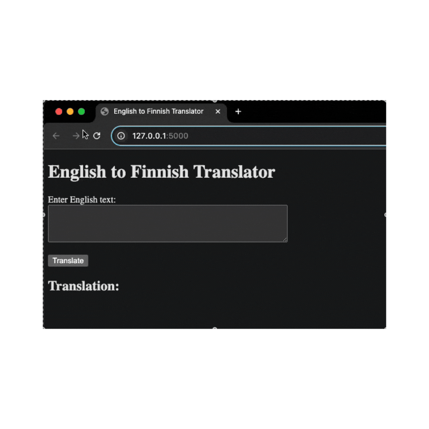

<h1 align="center"> English to Finnish translator </h1>

<p>    
    This project is a coding assignment done for a job application at Metropolia UAS. The job title is "Student assistants for Metropolia AI project". It is a small app created using Flask. The app has a text field and a submit button. The text written inside the field gets translated from English to Finnish onces submitted using the suggested
    <a href= https://huggingface.co/Helsinki-NLP/opus-mt-en-fi > model </a>. 
    <hr>
    
 
<h3 align="center"> Running the app in local host</h3>

---

<p align="center">  </p>

---

### Tech stack:

- Python
- FLASK
- PyTorch
- transformers


### To run the project locally, pleae clone the project and run:

1. Optionally, create and activate a Python virtual environment.
2. Install the required libraries with 
```bash 
pip install -r requirements.txt
```
3. Run the script 
```bash
python app.py
```
4. In your browser, navigate to local host port 5000 to access the web interface. 
```bash 
http://localhost:5000/

```
<br>
<p align="left"> <em>bijaykarki 2024</em> </p>